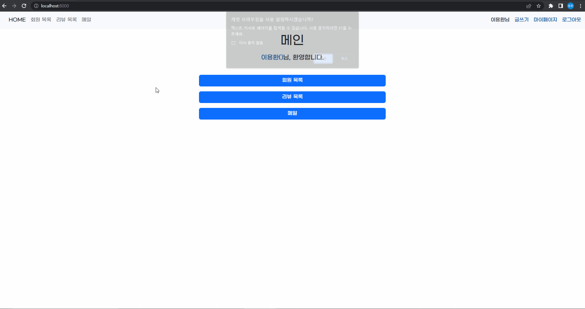
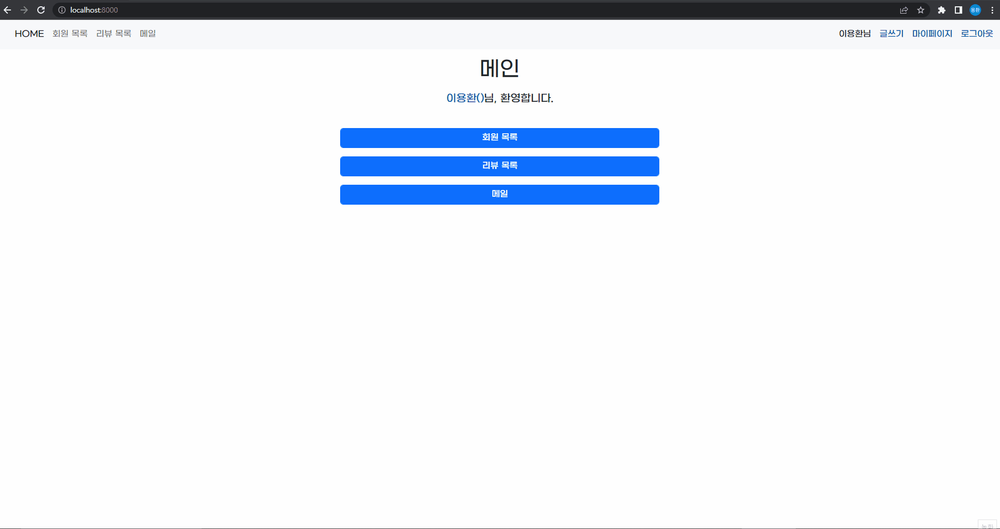
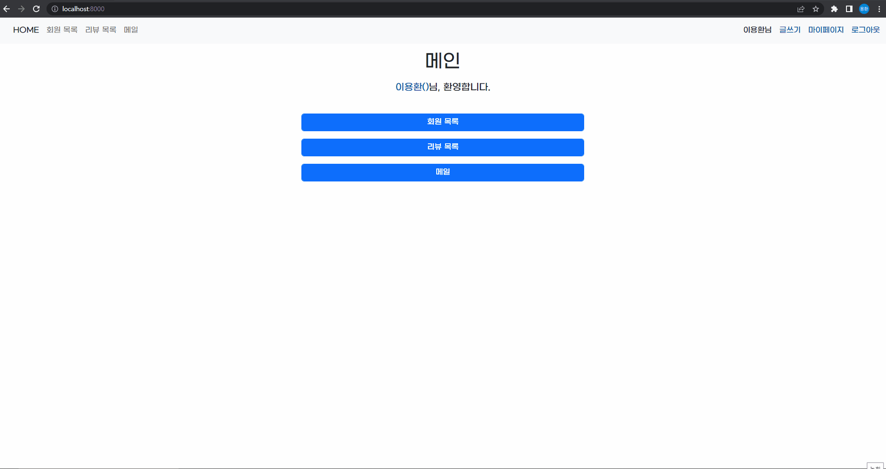

# 페어 프로그래밍 3

- 영화 리뷰 커뮤니티 만들기

## 프로젝트 기간

- 2022-10-14

## 사용 기술

- Python, Django, HTML, CSS, Bootstrap5

## 프로젝트 목적

페어 프로그래밍을 통한 영화 리뷰 커뮤니티 서비스 개발

- **CRUD** 구현
- **Staticfiles** 활용 정적 파일(이미지, CSS, JS) 다루기
- Django **Auth** 활용 회원 관리(회원가입 / 회원 조회 / 로그인 / 로그아웃)

## 맡은 기능 소개

- 이용환, 이메일 
  - 발신
    - 각 회원들의 PK를 ForeignKey로 지정.  
      받는 사람의 이메일로 들어온 정보를 각 회원의 이메일중 일치하는 사람이 있는지 확인하여,  
      없을 경우 이메일이 유효하지 않다는 메세지 출력.  
      있을 경우 회원의 이메일의 정보로 filter를 사용하여 쿼리를 가져 온 뒤에, 쿼리의 id를 fk로 지정 및 보내는 사람의 정보를 함께 데이터에 저장.  
      전제조건) 각 회원들의 이메일이 겹치지 않도록 회원가입시 이메일 중복을 막는 설정이 필요함.(설정 해놓았음)  
  
  - 수신
    - 메인 메일함에는 접속한 유저의 아이디와 메일DB에 FK 가 일치 하는 것을 가져오고 garbage 필드의 값이 False 인 것만 보이도록 설정.

  - 리뷰 작성자에게 바로 메세지 보내기 기능
    - 다른 사용자의 이름을 누를 시 메일 쓰기 창이 열리면서 받는 사람의 이메일은 자동으로 입력되는 기능을 추가했음.  
      기존의 데이터를 수정할 때 쓰는 instance 로는 구현이 불가능하여, initial={'field name': 넣을 값} 을 사용하여 구현.  
      다른 내용은 위에 발신에 적은 내용과 같음.

  - 읽음 처리 (BooleanField 사용)
    - 읽었는지 안읽었는지를 구분하기 위하여 값을 추가 했음.  
      메일 상세보기로 들어갈 경우에 만약 read 필드의 값이 False면 True로 바꿔주는 기능을 넣었음.  
    - 값이 False 면 굵은 글씨체로 표시  
    - 값이 True 면 일반 글씨체로 변경  

  - 중요 이메일 표시(BooleanField 사용)
    - 값이 True 면 중요 메일함에 추가. 휴지통 처럼 이동하지는 않음.   
    - 중요 메일 함에는 important 값이 True만 보이도록 설정.  

  - 휴지통 (BooleanField 사용)
    - 휴지통으로 보내기를 누르면 값이 True로 변경 및 휴지통으로 이동, 메일함에는 표시 X  
    - 휴지통에서 되돌리기 버튼을 누르면 값이 False로 변경 및 메일함으로 이동, 휴지통에는 표시 X  

## 프로젝트 역할

- 이용환 - 이메일 보내기 기능
- 조성윤 - 게시판 CRUD
- 김수빈 - 회원가입 / 회원 조회 / 로그인 / 로그아웃

## 프로젝트 느낀 점

운 좋게 잘하시는 분들과 같은 조가 되어, 다른 곳에 신경 안쓰고 맡은 역할에만 몰두할 수 있는 상황이었어서 편했습니다.  
처음에 브랜치 쓸 때는 다들 헷갈리고 그랬지만, 결국엔 브랜치를 쓰면서 작업을 수행했고, 제 시간안에 모두 맡은 역할을 다 끝내서 좋았습니다.  
디자인을 많이 신경쓰고 싶었지만, 기능에 너무 몰두 하는 바람에.. 디자인은 많이 신경쓰지 못했지만 다음에는 디자인도 깔끔하게 처리하고 싶습니다.   
